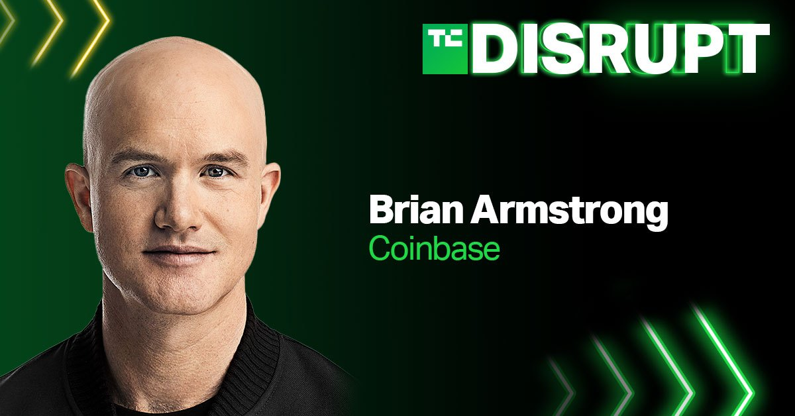

# Nervous About Investing in Cryptocurrency? 
---
"Of course I hate the success of Bitcoin. I don’t welcome a currency that’s so useful to kidnappers and extortionists and so forth, nor do I like just shuffling out of your extra billions of billions of dollars to somebody who just invented a new financial product out of thin air. I think I should say modestly that the whole damn development is disgusting and contrary to the interests of civilization,” *said Berkshire Hathaway Vice Chairman Charlie Munger during a Q&A session at Berkshire’s annual shareholder meeting in April of 2021.* 

## Overview and Origin
While my views do not align with Mr. Munger's, maybe some of his disdain is derived from the fact investing in cryptocurrency can be a daunting task. Coinbase Inc. co-Founders Brian Armstrong and Fred Ehrsam worked to solve this problem in 2012 when they created their online platform that allows merchants, consumers, and traders to transact with digital currency.

Before starting Coinbase, Brian Armstrong worked for 14 months at Airbnb as a technical product manager focused on fraud prevention. During this time, he learned about payment systems across the world and their problems while he became interested in crpytocoins. 

Headquartered in San Francisco, California, Coinbase boasts a team of 1,700 employees and it is the largest consumer bitcoin wallet in the world. The company supports 56 million global users and facilitates transactions in 190 countries. They have raised a total of $547.3M in funding over 14 rounds and their latest funding was raised on Oct 1, 2020.

## Business Activities

Brian Armstrong told Forbes last year, “I wanted the world to have a global, open financial system that drove innovation and freedom." He elaborated on this matter in an earlier blog post when he stated, ”we believe that open protocols for money will create more innovation, economic freedom, and equality of opportunity in the world, just like the internet did for publishing information."

To achieve this, Coinbase began by providing a safe and regulatory-compliant crypto exchange, and once they succeeded there, they branched out to offer crypto custodial services to institutions, plus a personal wallet and new currencies designed to appeal to those seeking more privacy with the goal of becoming the most trusted name in the cryptocurrency space. 

Coinbase is growing rapidly by adding 13 million new verified users to the platform in the first three months of 2021. The company is also focused on growing their institutional customers by adding 2,800 new institutional investors over the past year to bring their total institutional customer base to 7,000. 

Coinbase appeals to new crytpo traders because it is one of the most reliable cryptocurrecny exchanges in the world and it is also easy to use. Users simply link their bank account, transfer money and begin trading crytpocurrencies. 

As the popularity of crypto continues to grow, so does the competition for Coinbase. As the company prepared to respond to a more competitive marketplace, they knew they needed to invest in technology. "We're now in the phase of legitimizing this currency and bringing it to the masses," says Rob Witoff, director at Coinbase. "As part of that, our core tenets are security, scalability, and availability." According to Witoff, security is the most important of those tenets. 

In order to support their technology goals, they moved away from a mixture of third-party vendors and partnered with Amazon Web Services. This included building a new secure exchange with a custom-built transcational data engine. Since about 1 billion events flow through their system daily, they need complete and transparent real-time data. "By starting with the cloud at our core, we've been able to move fast where others dread," states Witoff. 

## Landscape
While many believe cryptocurrency is only a decade or so old, the origins of virtual coins date back to 1983. A cryptographer named David Chaum developed a series of transaction systems that established the framework for a new system of conducting anonymous transactions over a public network.

Bitcoin entered the scene in 2009 with a whitepaper by the mysterious person or group known as Satoshi Nakamoto. Bitcoin is a peer-to-peer electronic cash system which removes the need for an intermediary financial institution. In place of a trusted third party, is a system based on cryptography. The network timestamps transactions into a decntralized ledger system known as a blockchain. "Since then, the sheer power of the blockchain technology has inspired and fueled an entire ecosystem around it, focused on fully unleashing its potential," states Dr. Arati Baliga.

 While Bitcoin remains the most popular and influential cryptocurrency, it has tons of competition from other cryptocurrencies commonly referred to as altcoins. Some of the most notable alternatives are Ethereum, Litecoin, Cardano, and Polkadot. According to Statista, there were 66 cryptocurrencies in 2013 and now there are 6,044 as of July 2021.

As cryptocurrencies have grown in popularity, so too has the competition for Coinbase. Voyager is a powerful and secure trading app which provides 60+ digital assets. Kraken is a powerful bank and exchange which also provides information to Bloomberg Terminal. iTrustCapital is considered the leader in crypto IRA's as it provides you with the ability to buy or sell digital assets and VaultChain precious metals tax-free. Crypto.com has an entire crypto ecosystem that contains its app, Crypto Earn, Crypto Credit, the Crypto.com Exchange and DeFi Wallet along with Crypto Pay. Gemini is another competitor with an interesting approach providing multiple platform options based on user skill level while offering 26 different coins and tokens on their exchange. Rounding out the competition is the company with the best brand recognition in Robinhood, which provides traders with an intuitive and streamlined platform. 

## Results
Coinbase boasts sales of 1.3B USD and a market cap of 68.1B USD. In Q1 2021, Coinbase's trading volume was 335 billion USD. Over the past few years, Coinbase has consistently increased their share of the crypto market from 4.5% in 2018 to 11.3% in 2021. A large part of this success is due to expanding their reach with hedge funds, financial institutions and other institutional customers, which hold 44.8 billion worth of assets on the platform. 

On April 14, 2021 Coinbase joined the Nasdaq via a direct listing and became the first major crypto exchange in the United States to go public. This milestone firmly planted crypto in the mainstream financial system. "Right now, they have the name in the industry,” says Lambert Despaux, a Toptal freelance private markets expert and the founder of venture capital firm Schema Capital. “But the competition is going to be fierce.” According to CryptoCompare there are now 84 crypto exchanges vying for market share. They will also continue to feel more heat from Wall Street establishment firms as they continue to warm up to the asset class including major players like JPMorgan Chase, which plans to launch an actively managed Bitcoin fund this year.

Coinbase recently received a AA rating from CryptoCompare making them one of a few low risk exchanges. They will continue to be viewed as a top-tier exchange because of their focus on security, legal/regulatory, and transaction risk. Security is improved by holding over 95% of their assets in the more secure cold wallets versus hot wallets. A high legal/regulatory rating is awarded by carrying insurance against losses, following industry guidelines and providing various compliance statements. The third key component of mitigating risk is achieved through market surveillanc systems and on-chain transaction monitoring.
 
Binance, not mentioned above, is considered to be one of the largest threats to Coinbase. Launching just four years ago in China, they are offering more than 350 coins and their trading volume was 757 billion USD in March of this year. While they are ranked lower than Coinbase in quality and safety, they have been wildly innovative with products which appeal to more seasoned traders including one of the industry's first crypto derivatives platforms. 

"Coinbase made its name as the safest on-ramp for converting dollars into tokens and developed a brokerage business that attracted not just retail but a growing cadre of corporate clients like Tesla and hedge fund Third Point Management. While it lags rivals in trading volume, it still has the most assets under management on its platform, a $223 billion pool of liquidity that gives it power to provide superior pricing and trade execution that institutional investors demand," says Zachary Elfman, a Toptal freelance finance expert.

### Resources:
- [CNBC](https://www.cnbc.com/2021/05/01/charlie-munger-calls-bitcoin-disgusting-and-contrary-to-the-interests-of-civilization.html)
- [Forbes](https://www.forbes.com/companies/coinbase/?list=fintech/&sh=639f4a32699f)
- [Crunchbase](https://www.crunchbase.com/organization/coinbase)
- [Tech Crunch](https://techcrunch.com/2021/06/28/coinbase-ceo-brian-armstrong-is-coming-to-disrupt/)
- [AWS](https://aws.amazon.com/solutions/case-studies/coinbase/)
- [Armstrong blog](https://barmstrong.medium.com/what-is-coinbases-strategy-1c5413f6e09d)
- [Coinbase](https://www.coinbase.com)
- [Backlinko](https://backlinko.com/coinbase-users#key-coinbase-stats)
- [Benzinga](https://www.benzinga.com/money/coinbase-alternative/)
- [Investopedia](https://www.investopedia.com/terms/b/bitcoin.asp)
- [Statista](https://www.statista.com/statistics/863917/number-crypto-coins-tokens/)
- [Software Guild](https://www.thesoftwareguild.com/blog/a-brief-history-of-cryptocurrency/)
- [Columbus](https://columbus.org/wp-content/uploads/2018/10/wp_the-blockchain-landscape.pdf)
- [Fast Company](https://www.markcampbellproductions.com/headshots)
- [Toptal](https://www.toptal.com/finance/blockchain/coinbase)
- [Kraken](https://www.kraken.com/en-us/)
- [Crypto Compare](https://www.cryptocompare.com/)

